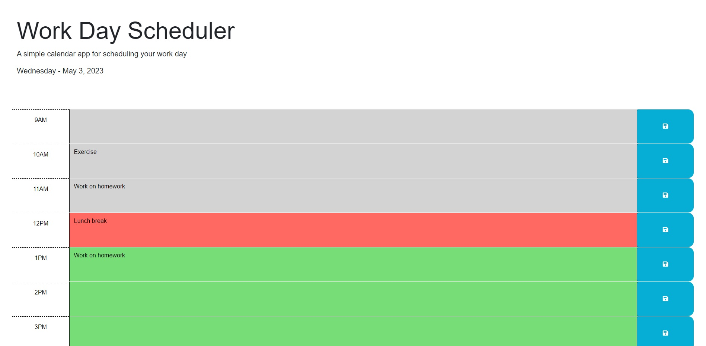

# Module 5 Challenge - Work Day Scheduler

## Description

This is a simple app that users can use to schedule their work days. They will be able to input tasks for each time block and save it to local storage in order to reference at a later time.

## Usage/Preview

Time blocks are styled based on the current time; the application will determine the current time and style the time blocks as either grey (past), red (present), or green (future). Users will be able to input their own tasks within the text boxes next to each hour and click the blue save button to save the content into their local storage. After refreshing or returning to the page, users should be able to see their past submissions persist.

Live: https://irene-panis.github.io/work-day-scheduler/

## Technologies Used
* jQuery
* Day.js

## Credits

The HTML and CSS were provided as starter code for the project.

## License

N/A